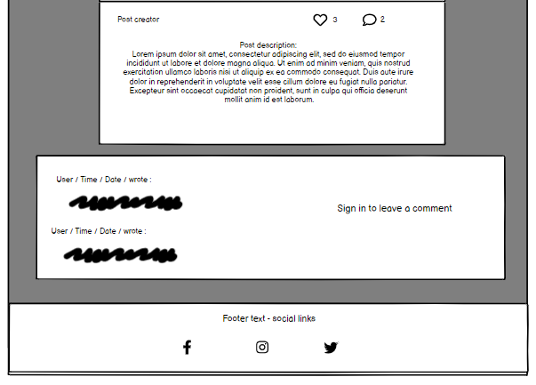
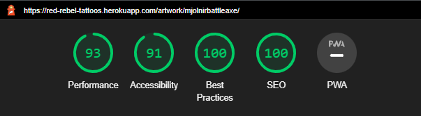

README.md

# Red Rebel Tattoo Studio

[This link takes you to the website](https://red-rebel-tattoos.herokuapp.com//)

This is the website for Red Rebels Tattoos. The main purpose of this site is encourage potential customers that Red Rebel Tattoos is the tattoo parlour for them and to offer several options for getting in touch. Customers can be encouraged by the customer reviews displayed on the main page, also the artwork section of the site features tattoos done by the staff. These posts can be viewed by all users, liked and commented on by signed-in users. Comments to the site will not be published until they have been approved by a staff member. There are two main options for making inquiries, a general contact form that is available to all users, and a booking inquiries form that is only available to signed-in users. All contact information is available on the Contact Page so the user can also get in touch by e-mail, phone or visiting the parlour. Signed in users can submit a review, which once approved by staff will be automatically added to the review carousel on the homepage.

The target audience for this site are people over the age of 18 who are interested in getting a tattoo, however all the content on the site is appropriate for all ages. 

The business goals of this website are:
* To raise brand awareness
* To display high quality examples of the artists' work
* Finding new customers by encouraging contact with the business and interaction with the content

The customer goals of this website are:
* To provide a pleasant experience to the user, ensuring the site is easy to navigate
* To offer relevant, helpful information to the user and the ability to request more easily
* To give the user the opportunity to express their opinions and engage with content and other users

 

## Planning

### Wireframes

I used [Balsamiq](https://balsamiq.com/) to create these wireframes:  

#### Home Page
  

#### Artwork Page

#### Individual Posts
  

The comments section is visible to all users. Signed in users have the option to comment.  
   
  
  
After submitting a comment the user is notified that their comment needs approval before being posted:  

#### Bookings Page
If the user is not signed in they will be prompted to visit the sign in or up page to access the bookings feature

#### Contact Page
  
The contact page features a review section but only if the user is signed in.  
  

#### Sign Up Page

#### Sign In Page  

## Features

### Existing features

#### Home Page
The home page, like all the pages of this site, has a responsive navigation bar. The brand name is placed on the far left, directly right of that are links to each of the pages.
On the far right of the navigation bar there are two options to sign up or sign in. Once signed in these options are replaced with text display your username. This is a dropdown menu that reveals the option to sign out.
Immediately below the navigation bar is a dismissable banner that alerts the user that they can "Book Your Free Consultation Today!" That is a link that will take them to the booking page.
Next is the hero image, which is an image of a bouquet of red roses, overlaying this is the name of the business and the business slogan. The 
The next section is the About Us section, titled 'Welcome to Red Rebel Tattoos" with a paragraph of information about the business.
The aim of this section is to connect with the user and give them an understanding of what to expect from the business and the site.

Below the about us section is a the review section. This consists of a carousel that displays approved reviews submitted to the site by users. It automatically slides through all the reviews. When a new review is submitted it awaits approval in the admin page, once approved it is automatically added to the carousel.

The next section is a call to action, with three options. The section is divided into three, not with borders, but the background colours differ,  going from light red, to mid red, to dark red.
The options encourage the user to either view the artwork, get in touch or make a booking inquiry. Each section has a link to the appropriate pages.

Lastly is the footer, present on every page. It is gray, to make the header, with the appropriate font, to fit in with the theme. The footer has links to social media sites, represented by their appropriate logo, that open in a new tab when clicked.

#### Artwork page

Immediately below the navigation bar is the header. This consists of an image of a red rose, to fit with the brand theme, and overlaying this is the title of the page 'Artwork' and a short descriptor of the page's content. 'Check out the wonderful artwork done by our talented tattooists'
Below this there are previews of the posts. Each preview consists of:
* the image 
* the artist's name
* a title 
* the date and time the post was created 
* the number of likes the post has

The post previews are displayed in rows and columns, with three posts to a row.

#### Post page
Every post has the same layout. Immediately below the navigation bar the post is displayed. Firstly it shows the title of the post, with the artist, date and time of posting below it in a smaller font.
It is important to show the artist's name with the artwork so the users can get an idea of each artist's style, and so the artists feel properly represented. Next is the image, the images are all different sizes, if the image does not fill the space there is a black background.
Below this is the description section, this part of the post describes the tattoo, including details of the style, colouring and how long it took to complete. This section can be edited only by the staff members on the admin page. Under the description is the like button with the like count beside it, followed by a comment icon with the comment count. Upon clicking the like button 
the page reloads, the like icon will have changed colour and the count increased by one. By pressing the button again those changes will be reversed, the user will have unliked the post.
The next section is the comments section. This is split into two parts. The first, on the left displays comments. Only approved comments will be displayed. Comments are displayed with the newest appearing at the bottom.
The right half of this section is for leaving a comment. If the user is signed in they wll see a simple form with just a body and a submit button. As the user must be signed in to comment there is no need to ask the user their name, their username is displayed above the body input.
If the user is not signed in they will only see a message informing them they must sign in to like and comment.
This is followed by the footer.

#### Bookings page

Immediately below the navigation bar is the header, that follows the same style as the artwork page, with an appropriate title and description.

There is a title and a description encouraging users to navigate to the contacts page if they have general inquiries. 
If the user is signed in they will see a form with the following fields:
* Artist - this is a dropdown menu with each of the tattooists names as options and an extra option of 'Any'
* Subject - this is a dropdown menu offering five choices:
	* Free Consultation
	* New Inquiry
	* Reschedule Appointment
	* Aftercare Inquiry
	* Other
* Requested date - this is field has a datepicker input
* Message - an empty text field
Followed by a standard submit button.

If the user is not signed in they will see a message encouraging the user to sign in or sign up to submit a booking inquiry.

This is followed by the footer.

#### Booking Successful

After submitting the form the user will be taken to the booking succesful page. This page follows all the standard styles and themes of the rest of the site
and has the simple message, "Your Booking Inquiry has been sent successfully!
A team member will be in touch ASAP"

#### Contact Page

Immediately below the navigation bar is the header, that follows the same style as the artwork page, with an appropriate title and description.
The next section is in two columns. The left side having information for getting in touch:
* Phone Number
* Email Address
* Physical Address
* Map of the physical location - an interactive map from Google Maps with a pointer on the specify address. This gives the user the option to get directions to the physical location

On the right is a form with the following fields:
* Name
* Email
* Subject
* Body
Followed by a standard submit button.

These fields are all standard text fields, this form is designed to be very open ended, giving the user the chance to get in touch with any possible questions they may have.

Below these sections is the review section. This section can only be seen by signed-in users. If a user is signed out they are urged to sign in to leave a review.
If the user is signed in they are presented with a simple form consisting of the following fields:
* Artist - this is a dropdown menu with each of the tattooists names as options and an extra option of 'Any'
* Review - a text field with a limit of 250 characters
Followed by a standard submit button.

Once a review is submitted, the review section is replaced by an alert informing the user that their review is awaiting approval.

This is followed by the footer.

#### Contact Successful

After submitting the form the user will be taken to the contact succesful page. This page follows all the standard styles and themes of the rest of the site
and has the simple message, 
"Your message has been sent successfully!
A team member will be in touch ASAP"

#### Sign Up Page

The Sign Up page is very simple, offering a prompt to the user to sign in (with a link to the sign up page) if they already have an account.
Then a basic form, requesting:
* E-mail Address
* Username
* Password
* Confirm Password - both password fields must match
Followed by a Sign Up button in the standard styles. 
If any of the form are not valid teh button will not submit, the page will show suggestions on how to fix the issues.

#### Sign In Page

The Sign In page is very simple, offering a prompt to the user to sign up (with a link to the sign up page) if they do not already have an account.
Then a basic form, requesting:
* Username
* Password
* Remember me - a checkbox
Followed by a Sign In button in the standard styles. 
If any of the form are not valid teh button will not submit, the page will show suggestions on how to fix the issues. 

#### Sign Out Page
This page is navigated to by clicking the username on the nav bar, to access the dropdown menu, then selecting Sign Out. The user will then be taken to the sign out page where they are asked if they are sure they want to sign out.
If the user confirms by clicking the sign out button they will be signed out and redirected to the home page. An alert banner will appear at the top of the page to confirm they hae been signed out. This banner is dismissable and will disappear on it's own after three seconds.

### Future features

I would like to give the users the ability to:
* Attach images to their inquiries
* Attach images to their reviews
* Edit their comments
* Delete their comments
* Like other users comments
* Reply to other users comments
* Filter posts by Artist
* Search for posts with specific terms

I would like to create an account page where the user can:
* View and edit their account details
* See the posts they have liked in the past
* Get notifications when their booking/contact inquiries have been replied to
* Get notifications when their review/comments have been approved
* Get notifications when someone likes/replies to their comment

While there is no element specifically stating or referring to its action as deletion. The like button provides the ability to remove information from the database.
In the future I would like to give users the ability to delete their own comments.

## Planning

* I created User Stories in GitHub, to cover the different eventualities of the site.
* I used Trello to list tasks and track my progress.
* I made initial sketches and notes on potential features.
* I researched websites of tattoo parlours to get an idea of relevant information, style and themes. I found that many of the sites were not very impressive, having very basic pages and minimal features, usually just presenting information. The websites often had dark colour schemes and gothic imagery, as tattoos are often associated with goths/heavy metal enjoyers despite tattoos becoming more and more mainstream. With this in mind I tried to use similar colour schemes, so as not to appear too unexpected. I used roses for the imagery, to not rely too heavily on gothic imagery, to expand appeal to an audience that might be discouraged by a more intense theme.

## User Experience

The ideal client for this business is:
* Is aged over 18
* Lives in the South Tyneside or North Tyneside.

Visitors to this website are searching for:
* A tattooist to work with them to design and create a tattoo that matches their criteria and budget. 

This project is the best way to help them achieve these things because:
* Most tattooists' websites have very poor UX.
* Other tattooists' websites are very basic and have little to no features.

This website is:
* Easy to navigate.
* Gives the user relevant and helpful information.
* Guides them to the goal of the website - to make an inquiry.

### Bugs
#### Solved bugs

* My review form returned an empty string where the 'review' input should have been. The name 'review' was already in the function. I renamed the input 'review_content' to solve the issue.
* When I deployed to Heroku after nearing the end of my project my staticfiles would not load in the heroku deployed app. The images were loading fine so I knew I had correctly connected the site to my cloudinary media library. I searched through several forums, not finding the exact cause of my issue. After also searching on Slack I found the most likely solved was to install Whitenoise and add it to the middleware in my settings.py file. This immediately solved my issue.

### Remaining bugs

#### Pagination Issue
My Artwork page was paginated using 'paginate_by'
On the final evening, before submitting my project the pagination stopped working. It would redirect to the homepage and throw no errors. I tried editing the code in my artwork.html file, to change the urls to include 'artwork/' before it specified the next page number. That would throw up an error, stating that there was no url match. I searched through several blogs including:
* [RealPython](https://realpython.com/django-pagination/#djangos-built-in-paginator)
* [Don't Repeat Yourself](https://dontrepeatyourself.org/post/django-pagination-with-class-based-view/)
* [StackOverflow](https://stackoverflow.com/questions/tagged/django-pagination)
In the end I ran out of time and decided this feature was not absolutely necessary. On returning to this project I would take the time to fix this, as it is a desirable feature.

### Validator tesing

* Used the Flake8 Linter in GitPod, with no issues.

Lighthouse:
Used Lighthouse testing to assess my website, the reports can be found below:  
Home Page:  
  
These are the issues lowering my performance scores. I adjusted as much as possible to improve my score, including converting all my images to .webp files.  
  
Artwork Page:  
  
Post Page:  
  
Booking Page:  
These are the issues lowering my performance scores. I adjusted as much as possible to improve my score, including:
* Converting all the images to .webp files
* Adjusting the Post model, adding a image-preview input
* Resizing all the images and reuploading the smaller images as preview images  
  
Contact Page:  
  
These are the issues lowering my performance scores. I adjusted as much as possible to improve my score, as far as I can tell the issues are being caused by Google Maps.  
  
Sign Up Page:  
  
Sign In Page:  
  
Sign Out Page:    

Manual Testing:
* Confirmed all links work as intended.
* Confirmed the admin site is accessible and functioning
* Confirmed the admin site is only accessible to admin/staff
* Confirmed registered users have all access to site functions (booking inquiries, review submission, liking and commenting on posts)
* Confirmed that unregistered users do not have access to those features
* Confirmed admin capability to create content, edit and delete content, and upload images to Cloudinary.
* Confirmed carousel works as intented.
* Confirmed unregistered users can view content and submit contact form without registering.
* Confirmed design is responsive on screens down to 300px.
* Confirmed registered site user can not access admin portal.
* Confirmed site users cannot access admin portal
* Confirmed site users cannot access logout page without being logged in to account.
* Confirmed all functionality works in both desktop and mobile as intented.
* Confirmed automatic deployment functionality.

## Deployment

For the final deployment I used the videos in the "I think therefore I blog" walkthrough.
In GitPod:
In settings:
* Change DEBUG to False.
* Add X_FRAME_OPTIONS = 'SAMEORIGIN'
* Commit and push the changes
* Ensure I have migrated the project.

In Heroku:
* Remove DISABLE_COLLECTSTATIC
* Deploy manually
* Deployment bug (staticfiles not there)
I returned to GitPod, installed WhiteNoise, added it to requirements.txt and placed it in the settings in the middleware.
* I commit and push the changes
* Set future deploys to automatic.

## Credits

["I think therefore I blog" walkthrough](https://learn.codeinstitute.net/courses/course-v1:CodeInstitute+FST101+2021_T1/courseware/b31493372e764469823578613d11036b/fe4299adcd6743328183aab4e7ec5d13/)  
[Bootstrap Documentation](https://getbootstrap.com/docs/4.0/components/carousel/) for implementing carousel on index.html  
I frequently used StackOverflow where and when I ran into issues, however all the code in this project I wrote myself.  
[Mikakallberg's README.md file](https://github.com/mikakallberg/Portfolio-Project-4/blob/main/README.md)for inspiration and guidance on the README.md file
